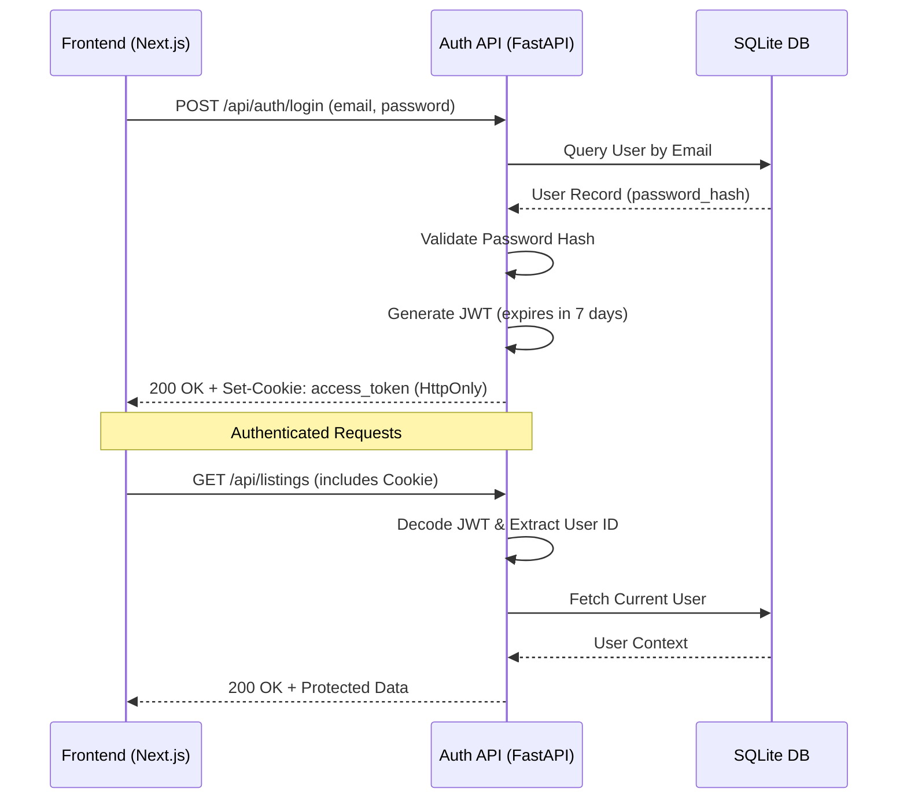
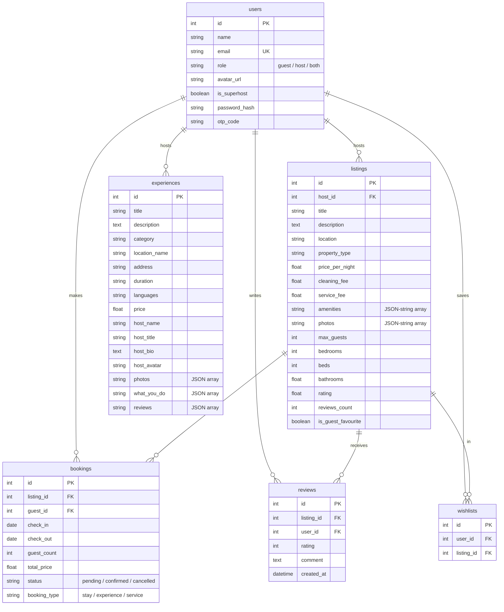

# Airbnb Clone Web Application
SDE Fullstack Assignment

A fully functional clone of the Airbnb web application. This project replicates Airbnb's design, visual language, responsive UI/UX, and core explore, search, and booking workflows.

---

## 🌐 Live Demo

- **Frontend Application**: [https://airbnb-frontend-an91.onrender.com/](https://airbnb-frontend-an91.onrender.com/)
- **Backend API**: [https://airbnb-backend-9lsk.onrender.com/](https://airbnb-backend-9lsk.onrender.com/)

> [!WARNING]
> **Hosting Notice:** This application is hosted on Render's free tier. Free instances spin down with inactivity, which can delay initial requests by **50 seconds or more** while the servers wake up. Please be patient on your first visit!

---

## 🛠️ Tech Stack

- **Frontend**: Next.js 15+ (TypeScript, React, Tailwind CSS, Lucide Icons)
- **Backend**: Python 3.13+ (FastAPI, SQLAlchemy, Uvicorn)
- **Database**: SQLite (SQLAlchemy ORM)

---

## 🚀 Getting Started & Setup

### Prerequisites
- Node.js (v18+)
- Python (v3.10+)

### 1. Backend Setup
1. Navigate to the `backend` directory:
   ```bash
   cd backend
   ```
2. Create and activate a Python virtual environment:
   ```bash
   python -m venv .venv
   # On Windows (PowerShell):
   .\.venv\Scripts\Activate.ps1
   # On macOS/Linux:
   source .venv/bin/activate
   ```
3. Install the dependencies:
   ```bash
   pip install -r requirements.txt
   ```
4. Start the FastAPI backend server:
   ```bash
   python run.py
   ```
   *The backend will run on `http://localhost:8003` with database tables automatically created and core seed data populated on startup.*
5. Run the Experiences seeder to populate dynamic experience records:
   ```bash
   python seed_experiences.py
   ```

### 1.1 Backend Setup (Docker / Production)
Alternatively, you can run the backend via the provided Dockerfile:
```bash
cd backend
docker build -t airbnb-backend .
docker run -p 8003:8003 -e PORT=8003 airbnb-backend
```

### 2. Frontend Setup
1. Navigate to the `frontend` directory:
   ```bash
   cd ../frontend
   ```
2. Install the Node modules:
   ```bash
   npm install
   ```
3. Start the Next.js development server:
   ```bash
   npm run dev
   ```
   *The frontend will run on `http://localhost:3000`.*

---

## 🔒 Authentication Architecture

Authentication in this application relies on stateful JSON Web Tokens (JWT) secured via HTTP-only cookies to prevent XSS attacks while maintaining a seamless user experience.



---

## 🗄️ Database Schema Design

The SQLite database consists of five core tables mapped via SQLAlchemy in `backend/app/models.py`:



---

## 🏛️ Architecture Overview

### 1. Backend Architecture (FastAPI)
- **Database Engine & Session (`database.py`)**: Uses SQLite with SQLAlchemy session management.
- **Data Models (`models.py`)**: Defines relational SQL tables with cascade deletion rules.
- **Endpoints (`routers/`)**:
  - `auth.py`: Simple session cookie-based JWT authentication, email verification, profile switching, and registration.
  - `listings.py`: Offers list filtering (by city/amenities/capacity), listing details, host CRUD, and review submission.
  - `bookings.py`: Handles date availability checking, overlap prevention, price computation, booking cancellation, and host dashboard statistics.
  - `wishlists.py`: Handles adding and removing listings from user wishlists.
  - `experiences.py`: Fetches specific, dynamic experience details from the SQLite database.

### 2. Frontend Architecture (Next.js)
- **App Router Layout (`layout.tsx`)**: Controls global styling and context providers.
- **Auth Context (`AuthContext.tsx`)**: Manages the logged-in user state, switching profiles, and login token refreshes.
- **Next.js Proxy Rewrites (`next.config.ts`)**: Configures Next.js to rewrite `/api/:path*` requests directly to `process.env.BACKEND_API_URL` (defaulting to `http://localhost:8003/api/:path*`), bypassing CORS.
- **Components (`components/`)**:
  - `navbar/Navbar.tsx`: Custom, collapsing search bar supporting guest popovers, flexible date calendars, and language/currency selectors.
  - `listings/ListingCard.tsx`: Recreates the signature 5-photo grid and database-synchronized heart button for wishlist management.

---

## 📌 Implementation Assumptions

1. **Wishlists/Favorites**: Persisted natively in the SQLite backend database via a dedicated `Wishlist` table, ensuring real-time syncing across devices and robust data persistence.
2. **Payments**: Real payment processing is out of scope. The reservation checkout displays full billing pricing (nights × rates + service & cleaning fees) and mocks confirmation instantly.
3. **Map Rendering**: Visual map widgets in the "Trips" layouts are loaded using an embedded, responsive global OpenStreetMap/Google Maps frame.
